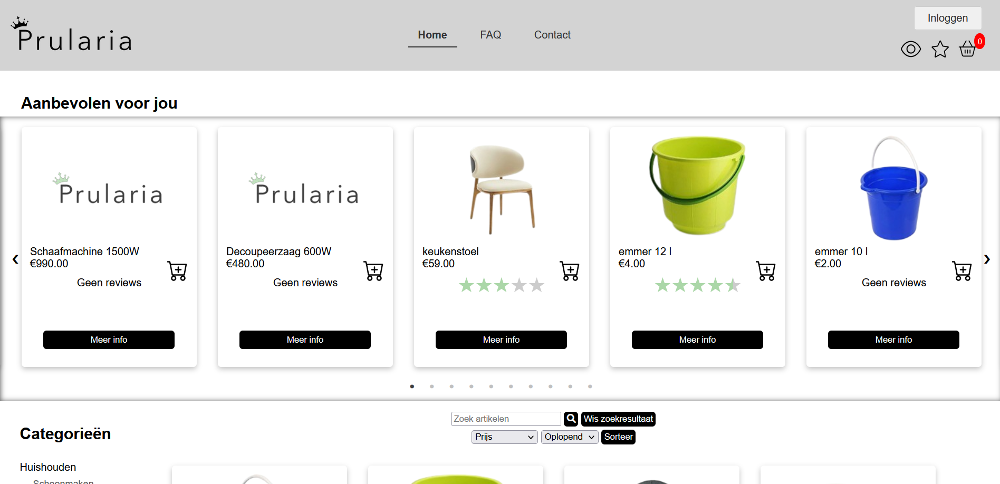

# Scrumproject Webshop Prularia

## Gebruik

- **Account aanmaken, inloggen en afmelden**: Gebruikers kunnen een account aanmaken, inloggen en zich afmelden om toegang te krijgen tot hun persoonlijke gegevens.
- **Artikels toevoegen aan winkelwagen en verwijderen**: Voeg je favoriete artikelen toe aan je winkelwagen en verwijder ze indien nodig.
- **Artikels bestellen en betalen**: Plaats bestellingen en voltooi de betaling om je artikelen te ontvangen.
- **Bestelgeschiedenis opzoeken**: Klanten kunnen hun bestelgeschiedenis bekijken om eerdere aankopen te controleren.
- **Reviews schrijven**: Alleen ingelogde klanten die een product hebben gekocht, kunnen reviews schrijven.

---

## Functionaliteiten

- **Zoekfunctie**: opzoeken van artikels mogelijk via zoekfunctie
- **Dag- en nachtmodus**: aanpassen van thema naar lichte of donkere achtergrond
- **Leesbaarheid voor dyslexie**: aanpassen van lettertype voor een betere leesbaarheid voor personen met dyslexie

---

## Voorbeeld 

